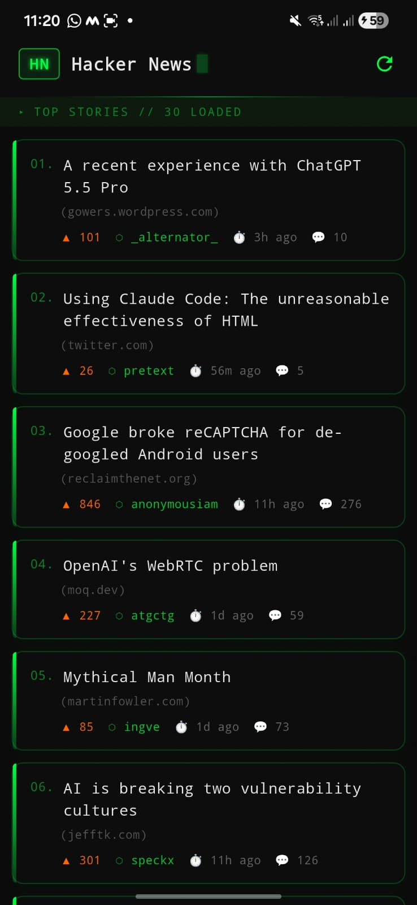
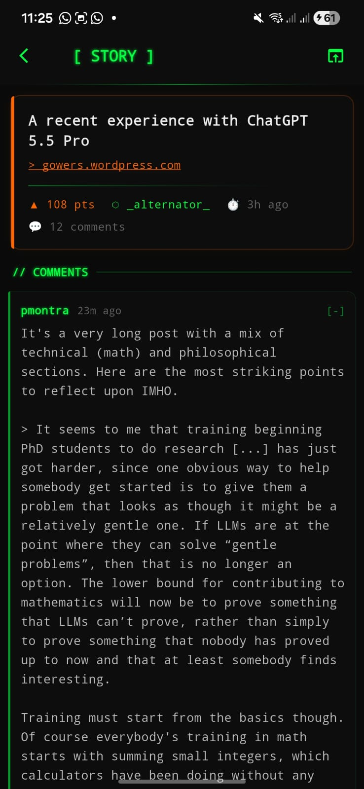

```
██╗  ██╗███╗   ██╗    ██████╗ ███████╗ █████╗ ██████╗ ███████╗██████╗
██║  ██║████╗  ██║    ██╔══██╗██╔════╝██╔══██╗██╔══██╗██╔════╝██╔══██╗
███████║██╔██╗ ██║    ██████╔╝█████╗  ███████║██║  ██║█████╗  ██████╔╝
██╔══██║██║╚██╗██║    ██╔══██╗██╔══╝  ██╔══██║██║  ██║██╔══╝  ██╔══██╗
██║  ██║██║ ╚████║    ██║  ██║███████╗██║  ██║██████╔╝███████╗██║  ██║
╚═╝  ╚═╝╚═╝  ╚═══╝    ╚═╝  ╚═╝╚══════╝╚═╝  ╚═╝╚═════╝ ╚══════╝╚═╝  ╚═╝
```

<div align="center">

> `[ A FLUTTER-POWERED HACKER NEWS CLIENT ]`


```
> STATUS: OPERATIONAL
> PLATFORM: ANDROID / iOS
> THEME: NEON TERMINAL
> STORIES: 30 LOADED
```

</div>

---

## `// OVERVIEW`

A **Hacker News reader** built with Flutter, featuring a dark terminal-style UI with neon green accents. Fetches live top stories and comments from the official Hacker News Firebase API.

---
## `// DOWNLOAD APK`

<div align="center">

[](https://github.com/shikhar11x/Flutter-HackerNews-Reader/releases/tag/v1.0)

```
> APK → https://github.com/shikhar11x/Flutter-HackerNews-Reader/releases/tag/v1.0
```

</div>

## `// SCREENSHOTS`

<div align="center">

| `HOME SCREEN` | `DETAIL SCREEN` |
|:---:|:---:|
|  |  |
| Top Stories List | Story + Comments |

</div>

## `// FILE STRUCTURE`

```
📁 hn_reader/
│
├── 📁 lib/
│   ├── 📁 models/
│   │   ├── 📄 comment.dart          → Comment data model
│   │   └── 📄 story.dart            → Story data model
│   │
│   ├── 📁 screens/
│   │   ├── 📄 home_screen.dart      → Top stories list screen
│   │   └── 📄 detail_screen.dart    → Story + comments screen
│   │
│   ├── 📁 services/
│   │   └── 📄 hn_api.dart           → HN Firebase API calls
│   │
│   ├── 📁 theme/
│   │   └── 📄 app_theme.dart        → Neon terminal theme config
│   │
│   ├── 📁 widgets/
│   │   ├── 📄 comment_tile.dart     → Recursive comment widget
│   │   ├── 📄 loading_shimmer.dart  → Shimmer loading effect
│   │   └── 📄 story_card.dart       → Story list card widget
│   │
│   └── 📄 main.dart                 → App entry point
│
├── 📄 pubspec.yaml
└── 📄 README.md
```

---

## `// SCREENS`

| Home Screen | Detail Screen |
|:-----------:|:-------------:|
| `TOP STORIES // 30 LOADED` | `[ STORY ] + // COMMENTS` |
| Numbered story cards | Full story metadata |
| Points · Author · Time · Comments | Threaded comments with nesting |
| Pull-to-refresh | Open story in browser |

---

## `// API ENDPOINTS`

```dart
// Top Stories (returns list of IDs)
GET https://hacker-news.firebaseio.com/v0/topstories.json

// Story / Comment Detail (by ID)
GET https://hacker-news.firebaseio.com/v0/item/{id}.json
```

---

## `// FEATURES`

```
[✓] Fetch top 30 HN stories
[✓] Story cards — title, domain, points, author, time, comment count
[✓] Detail screen — full story info + first-level comments
[✓] Nested / threaded comments (bonus)
[✓] Loading shimmer animation
[✓] Open story URL in browser
[✓] Terminal-style neon green dark theme
[✓] Android & iOS support
```

---

## `// GETTING STARTED`

```bash
# 1. Clone the repository
git clone https://github.com/<your-username>/hn_reader.git
cd hn_reader

# 2. Install dependencies
flutter pub get

# 3. Run on Android
flutter run

# 4. Build APK
flutter build apk --release
```

> **Requirements:** Flutter SDK 3.x · Dart 3.x · Android SDK 21+

---

## `// DEPENDENCIES`

```yaml
dependencies:
  flutter:
    sdk: flutter
  http: ^1.2.0              # API calls
  html: ^0.15.4             # Parse HN comment HTML
  flutter_html: ^3.0.0      # Render HTML comments
  shimmer: ^3.0.0           # Loading shimmer effect
  url_launcher: ^6.2.0      # Open stories in browser
  timeago: ^3.6.0           # "3h ago" time formatting
```

---

## `// THEME`

The app uses a **terminal / hacker aesthetic**:

```
Background  →  #0D0D0D  (near black)
Primary     →  #00FF41  (matrix green)
Accent      →  #FF6600  (HN orange — upvotes)
Text        →  #E0E0E0  (light grey)
Cards       →  #111111  (dark surface)
Border      →  #1A3A1A  (dark green border)
Font        →  JetBrains Mono / monospace

---

<div align="center">

```
> MADE WITH FLUTTER


</div>
